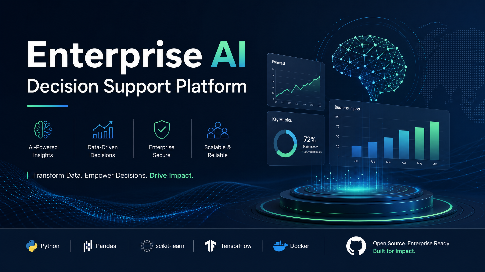
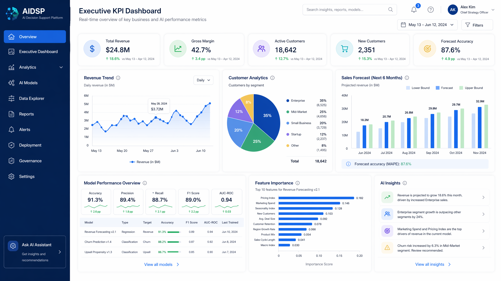

# Enterprise AI Decision Support Platform

 <!-- Placeholder for a professional banner -->

## 🚀 Project Overview

This project develops an **Enterprise AI Decision Support Platform** designed to empower businesses with advanced analytical capabilities. It leverages Machine Learning to analyze operational and financial data, generate predictive insights, visualize key performance indicators (KPIs), and recommend actionable business strategies.

## 🎯 Business Problem

Modern enterprises face challenges in extracting meaningful insights from vast amounts of data, leading to suboptimal decision-making. Traditional analytical methods often lack the predictive power and scalability required to stay competitive. This platform addresses these issues by providing a comprehensive AI-driven solution for data analysis and strategic guidance.

## 🏗️ Solution Architecture

The platform is built with a modular and scalable architecture, integrating various components for data processing, model training, API services, and interactive visualization:

- **Data Layer**: Handles data ingestion, storage, and management.
- **Preprocessing Layer**: Cleans, transforms, and engineers features from raw data.
- **Machine Learning Layer**: Trains, evaluates, and manages various ML models.
- **API Layer (FastAPI)**: Provides endpoints for predictions and data interaction.
- **Dashboard Layer (Streamlit)**: Offers an interactive user interface for data exploration, model management, and decision support.
- **MLOps (MLflow)**: Manages the ML lifecycle, including experiment tracking, model registry, and deployment.
- **Containerization (Docker)**: Ensures consistent environments for development and deployment.

## ✨ Features

- **Data Management**:
    - Upload CSV datasets
    - Automatic data validation
    - Missing value handling
    - Feature engineering
- **Exploratory Data Analysis (EDA)**:
    - Interactive charts and dashboards
- **Machine Learning**:
    - Train multiple ML models (Logistic Regression, Random Forest, XGBoost, LightGBM)
    - Model comparison and automatic best-model selection
    - Business KPI prediction
    - Sales forecasting
    - Revenue trend analysis
    - Customer segmentation
    - Risk scoring
- **AI-driven Recommendations**:
    - AI-generated business recommendations
- **Deployment & Monitoring**:
    - Prediction API using FastAPI
    - Interactive Streamlit dashboard
    - Experiment tracking with MLflow

## 📊 Dashboard Preview

The interactive Streamlit dashboard provides a comprehensive view of business performance and predictive insights:

- **Executive KPI Dashboard**: High-level overview of critical business metrics.
- **Revenue Trends**: Visualization of historical and forecasted revenue.
- **Customer Analytics**: Insights into customer segments and behavior.
- **Sales Forecast**: Predictive analytics for future sales performance.
- **Model Performance**: Evaluation metrics and insights into ML model efficacy.
- **Feature Importance**: Understanding which factors drive predictions.
- **Prediction History**: Tracking past predictions and their outcomes.

 <!-- Placeholder for a dashboard screenshot -->

## 🗃️ Dataset Description

The platform is designed to work with various tabular datasets. For demonstration purposes, a `sample_data.csv` is included in the `data/` directory. This dataset typically includes numerical and categorical features relevant to business operations and a target variable for prediction (e.g., customer churn, sales outcome).

## ⚙️ Machine Learning Pipeline

1.  **Data Ingestion**: CSV datasets are loaded into the system.
2.  **Data Preprocessing**: Missing values are handled, and features are engineered.
3.  **Model Training**: Multiple ML models are trained and evaluated using `mlflow` for experiment tracking.
4.  **Model Selection**: The best performing model is selected and registered.
5.  **Prediction**: The trained model is used to generate predictions via the FastAPI.
6.  **Visualization**: Results and insights are presented through the Streamlit dashboard.

## 🚀 Installation

To set up and run the project locally, follow these steps:

1.  **Clone the repository**:
    ```bash
    git clone https://github.com/YOUR_USERNAME/enterprise-ai-decision-support-platform.git
    cd enterprise-ai-decision-support-platform
    ```
2.  **Build and run with Docker Compose**:
    ```bash
    docker-compose up --build
    ```
    This will start both the FastAPI (on port 8000) and Streamlit dashboard (on port 8501).

3.  **Access the applications**:
    -   FastAPI: `http://localhost:8000`
    -   Streamlit Dashboard: `http://localhost:8501`

## 📖 API Documentation

The FastAPI includes automatically generated interactive API documentation (Swagger UI) available at `http://localhost:8000/docs` once the API service is running.

## 🛠️ Technologies Used

-   **Backend**: Python 3.11, FastAPI
-   **Frontend**: Streamlit
-   **Machine Learning**: Scikit-learn, XGBoost, LightGBM, Pandas, NumPy
-   **Data Visualization**: Plotly
-   **MLOps**: MLflow
-   **Containerization**: Docker, Docker Compose
-   **Database**: SQLite (for MLflow tracking)

## 📈 Performance Metrics

Model performance is tracked using MLflow, including metrics such as:

-   Accuracy
-   Precision
-   Recall
-   F1-score

These metrics are displayed in the Streamlit dashboard for easy monitoring and comparison of different model runs.

## 🔮 Future Improvements

-   Integration with cloud platforms (AWS, Azure, GCP) for scalable deployment.
-   Advanced MLOps features, including continuous integration/continuous deployment (CI/CD) for models.
-   Support for real-time data streaming and online learning.
-   More sophisticated feature engineering techniques and automated feature selection.
-   Enhanced security features and user authentication.
-   Customizable dashboard layouts and reporting.

## 📄 License

This project is licensed under the MIT License - see the [LICENSE](LICENSE) file for details.
